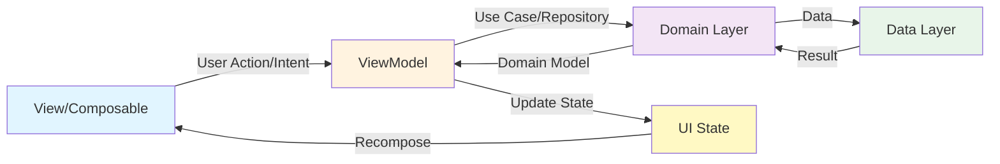
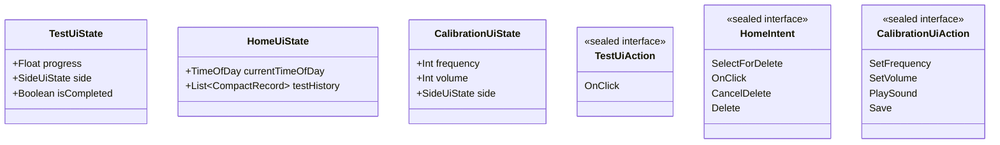
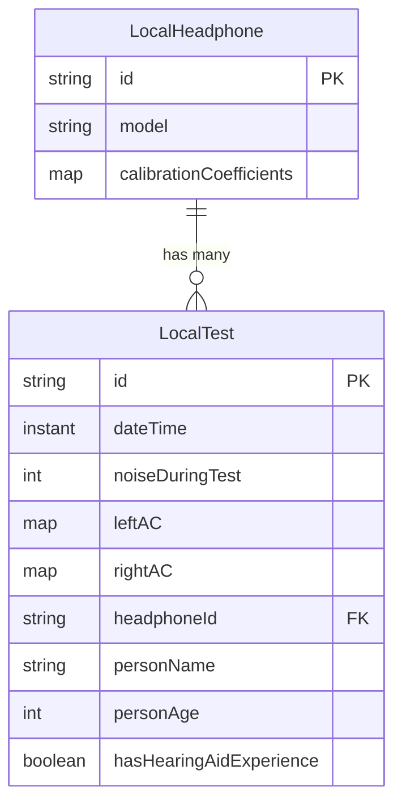
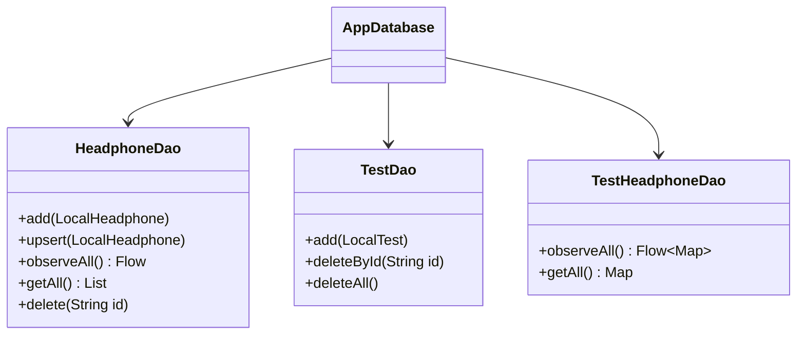
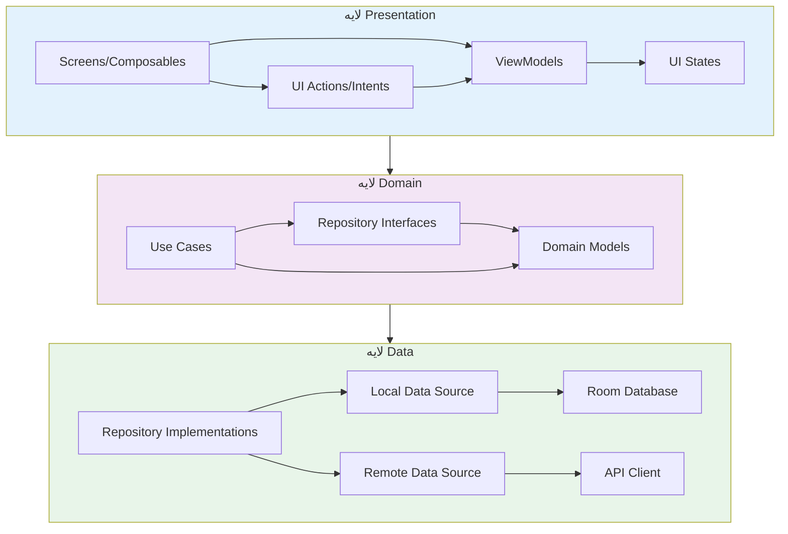
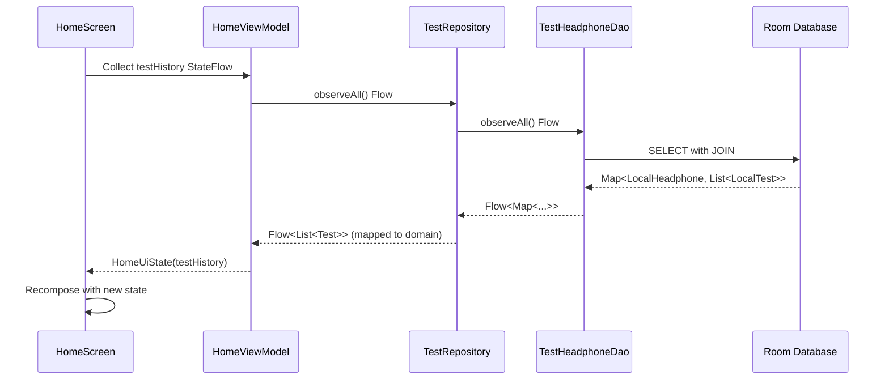
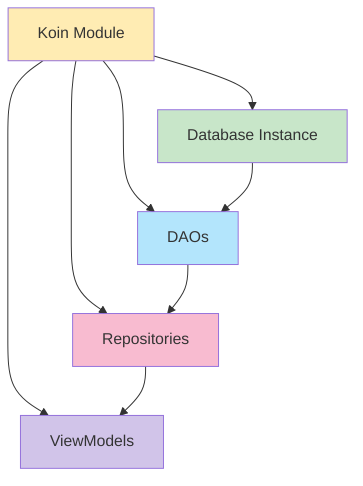

# معماری پروژه AudioSense

## مقدمه
AudioSense یک اپلیکیشن اندرویدی و iOS برای سنجش شنوایی است که با استفاده از Kotlin Multiplatform و Jetpack Compose ساخته شده است. این پروژه از معماری MVI (Model-View-Intent) و الگوی Clean Architecture برای جداسازی لایه‌های مختلف استفاده می‌کند.

## معماری MVI (Model-View-Intent)

پروژه از الگوی MVI برای مدیریت وضعیت UI و جریان داده‌ها استفاده می‌کند. در این الگو:

- **Model (State)**: وضعیت immutable که UI را نمایش می‌دهد
- **View**: Composable های Jetpack Compose که state را رندر می‌کنند
- **Intent (Action)**: رویدادهایی که کاربر یا سیستم تولید می‌کنند

### جریان MVI



### نمونه‌هایی از State و Intent



## ساختار دیتابیس (Room)

پروژه از Room Database برای ذخیره‌سازی محلی داده‌ها استفاده می‌کند. دیتابیس شامل دو جدول اصلی است:

### نمودار ER دیتابیس



### توضیحات جداول

**LocalHeadphone**: هدفون‌های کالیبره شده
- `id`: شناسه یکتا
- `model`: مدل هدفون (مثلاً "Galaxy Buds FE")
- `calibrationCoefficients`: ضرایب کالیبراسیون به ازای هر فرکانس
  - Format: `Map<Int, Pair<Int, Int>>` 
  - Key: فرکانس (125, 250, 500, 1000, 2000, 4000, 8000 Hz)
  - Value: `(playedVolume, measuredVolume)` به دسی‌بل (dB)

**LocalTest**: تست‌های شنوایی انجام شده
- `id`: شناسه یکتا
- `dateTime`: زمان انجام تست
- `noiseDuringTest`: میزان نویز محیط در حین تست
- `leftAC/rightAC`: منحنی شنوایی گوش چپ و راست
  - Format: `Map<Int, Int>` (فرکانس → دسی‌بل)
- `headphoneId`: ارجاع به هدفون استفاده شده
- سایر اطلاعات دموگرافیک

### DAO ها



**TestHeadphoneDao** از Join Query استفاده می‌کند تا داده‌های هدفون و تست‌های مربوطه را با هم برگرداند. این ساختار امکان نمایش تاریخچه تست‌ها را گروه‌بندی شده بر اساس هدفون استفاده شده فراهم می‌کند:
```kotlin
Map<LocalHeadphone, List<LocalTest>>
```

### Type Converters

برای ذخیره‌سازی ساختارهای پیچیده (Map, Instant) در SQLite:
- `mapPairToString` / `stringToMapPair`: تبدیل `Map<Int, Pair<Int,Int>>` به JSON
- `mapToString` / `stringToMap`: تبدیل `Map<Int, Int>` به JSON  
- `instantToString` / `stringToInstant`: تبدیل Kotlin Instant به ISO 8601 string

## معماری سه لایه (Clean Architecture)

پروژه از Clean Architecture با سه لایه اصلی استفاده می‌کند:



### لایه Presentation
- **Screens**: صفحات UI با Jetpack Compose
  - `HomeScreen`: نمایش لیست تست‌های قبلی
  - `TestScreen`: انجام تست شنوایی
  - `ResultScreen`: نمایش نتایج آدیوگرام
  - `CalibrationScreen`: کالیبراسیون هدفون
  - `SelectDeviceScreen`: انتخاب هدفون
  
- **ViewModels**: مدیریت state و business logic
  - از Koin برای dependency injection استفاده می‌شود
  - هر ViewModel با یک Screen متناظر است

### لایه Domain
- **Repository Interfaces**: 
  - `TestRepository`: مدیریت CRUD تست‌ها با پشتیبانی از Flow
  - `HeadphoneRepository`: مدیریت CRUD هدفون‌ها + همگام‌سازی با سرور

- **Models**: مدل‌های خالص بدون وابستگی به فریمورک
  - `Test`, `Headphone`, `VolumeRecordPerFrequency`

- **Use Cases**: منطق کسب‌وکار
  - `PureToneAudiometry`: مدیریت منطق تست صوتی
  - `HeadphoneCalibrator`: محاسبات کالیبراسیون
  - `AudiogramSerializer`: export و اشتراک‌گذاری نتایج
  - `SoundPlayer`: پخش صوت
  - `AudiometryPCMGenerator`: تولید سیگنال صوتی

### لایه Data
- **Repository Implementations**: پیاده‌سازی interface های Domain
  
- **Local Data Source**: 
  - Room Database با DAO ها
  - Entity های LocalTest و LocalHeadphone
  - Type Converters برای ذخیره ساختارهای پیچیده

- **Remote Data Source**:
  - `HeadphoneFetcher`: دریافت لیست هدفون‌های کالیبره شده از API
  - `TokenManager`: مدیریت توکن احراز هویت

## جریان داده در یک نمونه عملی

مثال: نمایش لیست تست‌های قبلی در `HomeScreen`



### نقش Koin (Dependency Injection)



تمام dependency ها در `Module.kt` با Koin تعریف می‌شوند:
```kotlin
single<AppDatabase> { getRoomDatabase(...) }
single<HeadphoneDao> { get<AppDatabase>().headphoneDao() }
single<TestRepository> { TestRepositoryImpl(...) }
viewModelOf(::HomeViewModel)
```

## نقاط قوت معماری

1. **جداسازی واضح**: هر لایه مسئولیت مشخصی دارد
2. **تست‌پذیری**: با استفاده از interface ها، mock کردن آسان است
3. **Reactive**: استفاده از Flow برای به‌روزرسانی خودکار UI
4. **Type Safety**: استفاده از sealed class ها برای State و Intent
5. **Single Source of Truth**: State در ViewModel مدیریت می‌شود
6. **Multiplatform**: کد مشترک بین Android و iOS

## تکنولوژی‌های استفاده شده

- **Kotlin Multiplatform**: اشتراک کد بین پلتفرم‌ها
- **Jetpack Compose**: UI declarative
- **Room**: دیتابیس محلی
- **Koin**: Dependency injection
- **Coroutines + Flow**: برنامه‌نویسی ناهمزمان
- **Kotlinx Serialization**: سریالیزاسیون JSON
