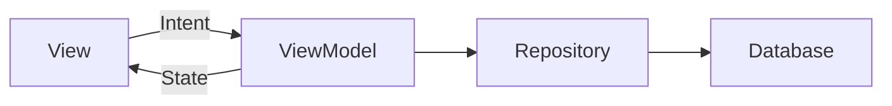
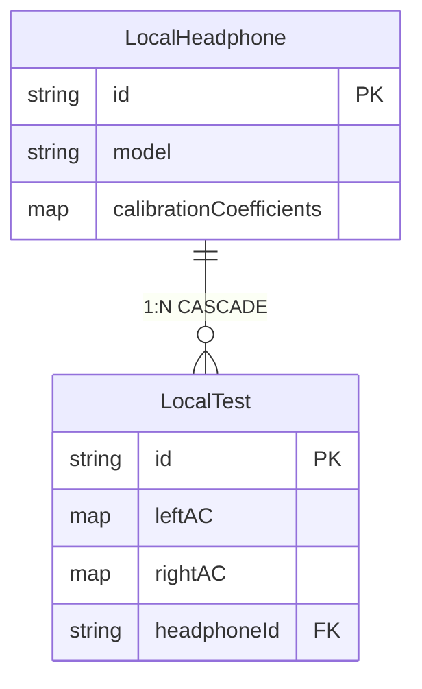
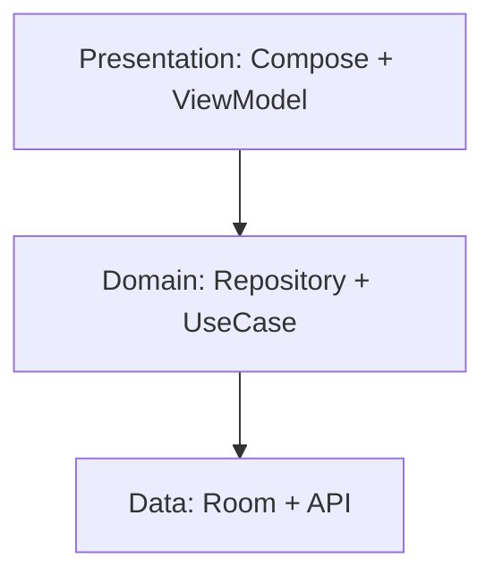

# معماری AudioSense

## MVI Pattern

## دیتابیس (Room)

**LocalHeadphone**: کالیبراسیون `Map<Int, Pair<Int,Int>>`  
**LocalTest**: نتایج شنوایی `Map<Int, Int>`

## معماری لایه‌ای

**Stack**: Kotlin Multiplatform، Compose، Room، Koin، Flow
