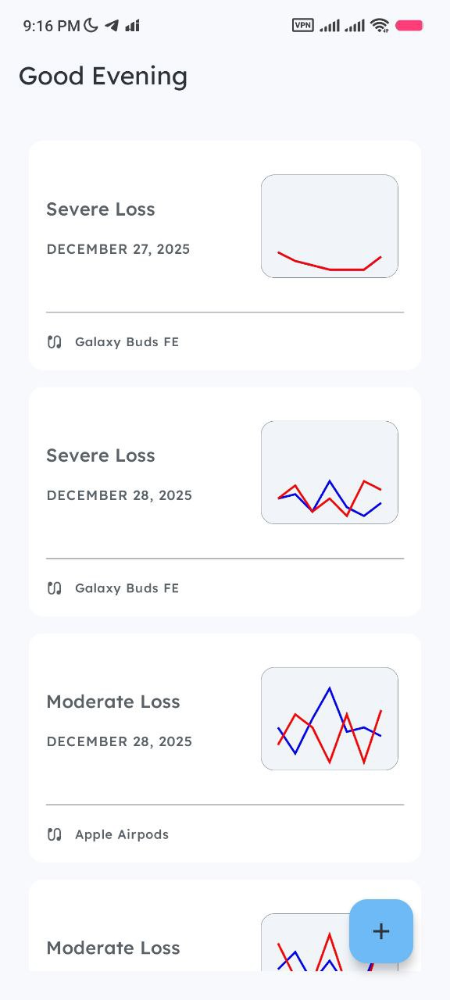
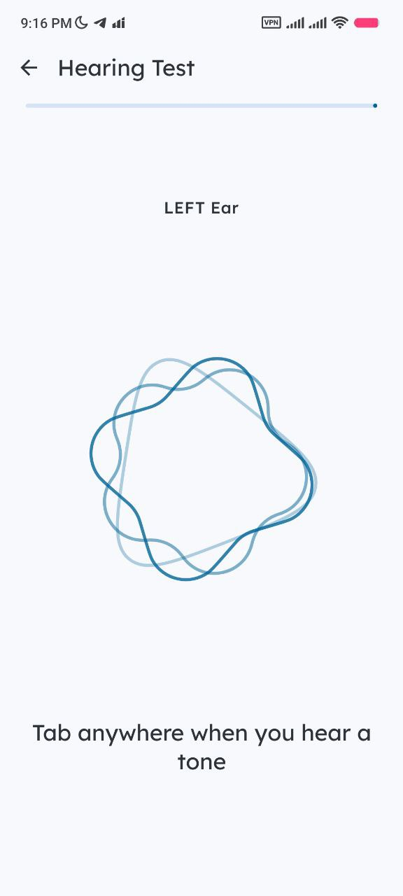
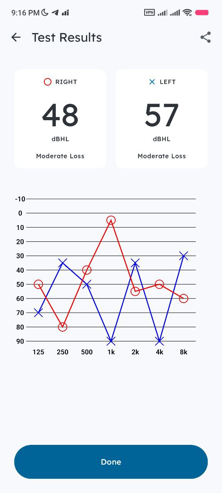

## AudioSense

    Note: This project is currently under active development.

A modern, expressive audiometry application for Android & iOS, built with Kotlin Multiplatform and a focus on user-friendly design powered by Material 3 Expressive.
### Screenshots

### 📋 About The Project

AudioSense is a native mobile application for Android & iOS designed to provide users with an accessible and intuitive way to measure their hearing levels. Built from the ground up with Kotlin Multiplatform and Jetpack Compose, the app offers a clean, calming, and user-friendly experience.

The core mission is to translate complex hearing data into meaningful, real-world insights. From a guided test preparation process to understanding your results, every aspect is crafted to be clear and reassuring. The project leverages the Compose Multiplatform Wizard template for a robust and scalable foundation.

### ✨ Key Features
- Accurate Testing: A focused, minimalist interface for conducting pure-tone audiometry tests, with built-in safeguards for a better experience.
- Headphone Calibration: Results are calibrated for different headphone models to ensure higher accuracy.
- Noise Meter: An integrated noise meter helps ensure you're in a sufficiently quiet environment before you begin, preventing inaccurate results.
- Visual & Descriptive Results: View your hearing data on a clear audiogram chart and get useful, easy-to-understand insights about what your results mean in everyday situations.
- Expressive UI: A dynamic and responsive interface built entirely with Jetpack Compose, following Material 3 Expressive Design principles.
- Customization: Settings for theme (Light/Dark/System) and language.

### 🚀 Tech Stack
- Framework: Kotlin Multiplatform (targeting Android & iOS)
- UI: Jetpack Compose / Compose Multiplatform
- Navigation: androidx.navigation
- Dependency Injection: Koin
- Database: Room
- Logging: Kermit

### License

This project is licensed under the MIT License. See the LICENSE file for more details.
