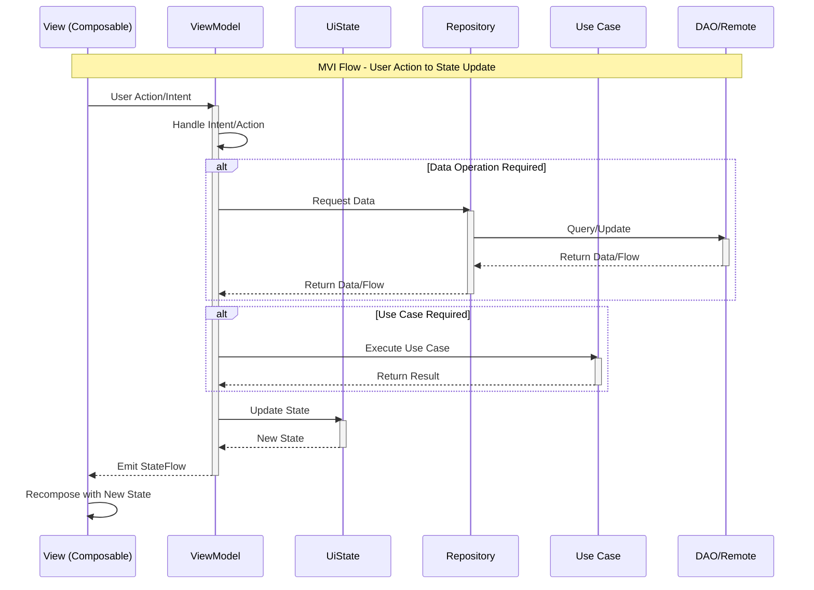
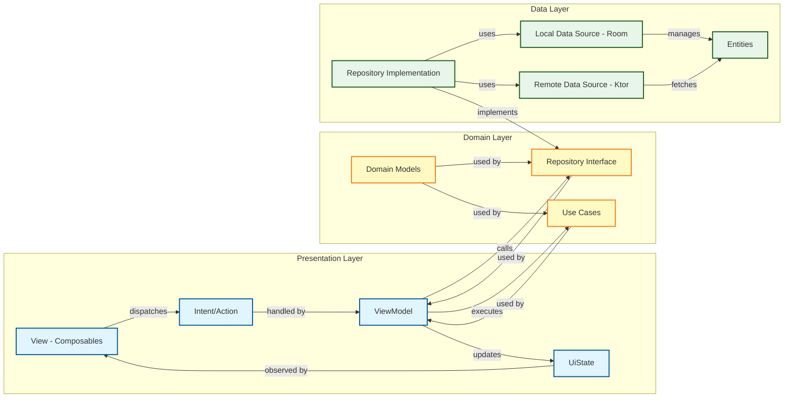

# AudioSense MVI Architecture

This document describes the complete MVI (Model-View-Intent) architecture of the AudioSense application using Mermaid diagrams.

## Complete Architecture Overview

```mermaid
graph TB
    subgraph "PRESENTATION LAYER - MVI"
        subgraph "Home Screen"
            HomeViewModel["HomeViewModel
            ---
            Fields:
            - currentTimeOfDay: StateFlow
            - testRecords: Flow
            - _uiState: MutableStateFlow
            - uiState: StateFlow
            ---
            Methods:
            + handleIntent(HomeIntent)
            - handleSelectForDelete()
            - handleCancelDelete()
            - handleDelete()
            - combineUiFlows()"]
            
            HomeUiState["HomeUiState
            ---
            + currentTimeOfDay: TimeOfDay
            + testHistory: TestHistory"]
            
            HomeIntent["HomeIntent
            ---
            + SelectForDelete(record)
            + OnClick(record)
            + CancelDelete
            + Delete"]
            
            HomeViewModel --> HomeUiState
            HomeViewModel --> HomeIntent
        end
        
        subgraph "Test Screen"
            TestViewModel["TestViewModel
            ---
            Fields:
            - handle: SavedStateHandle
            - navigationEvents: SharedFlow
            - _uiState: MutableStateFlow
            - uiState: StateFlow
            ---
            Methods:
            + onUiAction(TestUiAction)
            - handleClick()
            - startAudiometryProcedure()
            - save()
            - combineFlows()"]
            
            TestUiState["TestUiState
            ---
            + progress: Float
            + side: SideUiState"]
            
            TestUiAction["TestUiAction
            ---
            + OnClick"]
            
            NavigationEvent["NavigationEvent
            ---
            + NavigateToResult(route)"]
            
            TestViewModel --> TestUiState
            TestViewModel --> TestUiAction
            TestViewModel --> NavigationEvent
        end
        
        subgraph "Calibration Screen"
            CalibrationViewModel["CalibrationViewModel
            ---
            Fields:
            - frequencyOctaves: List
            - _selectedSide: MutableStateFlow
            - _selectedFrequency: MutableStateFlow
            - _frequenciesVolumeData: MutableStateFlow
            - currentVolumeToPlay: StateFlow
            - currentMeasuredVolume: StateFlow
            - _uiState: MutableStateFlow
            - uiState: StateFlow
            ---
            Methods:
            + onUiAction(CalibrationUiAction)
            - onSetFrequency()
            - onSetPlayedVolumeForCurrentFrequency()
            - onSetMeasuredVolumeForCurrentFrequency()
            - saveCalibration()
            - playSound()
            - setSide()
            - combineUiFlows()"]
            
            CalibrationUiState["CalibrationUiState
            ---
            + frequencies: List
            + frequency: Int
            + volumeData: VolumeData
            + side: Side"]
            
            CalibrationUiAction["CalibrationUiAction
            ---
            + SaveCalibrationUi(model)
            + SetFrequency(frequency)
            + SetVolumeToPlayForCurrentFrequency(dB)
            + SetMeasuredVolumeForCurrentFrequency(dB)
            + PlaySound
            + Save(model)
            + SetSide(side)"]
            
            CalibrationViewModel --> CalibrationUiState
            CalibrationViewModel --> CalibrationUiAction
        end
        
        subgraph "Result Screen"
            TestResultViewModel["TestResultViewModel
            ---
            Fields:
            - handle: SavedStateHandle
            - testId: String
            - resultFlow: Flow
            - uiState: StateFlow
            ---
            Methods:
            + handleIntent(TestResultIntent)
            - handleShareText()
            - handleShareImage()"]
            
            TestResultUiState["TestResultUiState
            ---
            + Loading
            + Ready:
              - generalLeftHearingLoss: Int
              - generalRightHearingLoss: Int
              - describedLeftHearingLoss: String
              - describedRightHearingLoss: String
              - leftAC: Map
              - rightAC: Map"]
            
            TestResultIntent["TestResultIntent
            ---
            + ShareText
            + ShareImage(bitmap)"]
            
            TestResultViewModel --> TestResultUiState
            TestResultViewModel --> TestResultIntent
        end
        
        subgraph "Select Device Screen"
            SelectDeviceViewModel["SelectDeviceViewModel
            ---
            Fields:
            - _uiState: MutableStateFlow
            - uiState: StateFlow
            - headphones: Flow
            ---
            Methods:
            + handleAction(SelectDeviceUiAction)
            - setSelectedDevice()
            - deleteHeadphone()"]
            
            SelectDeviceUiState["SelectDeviceUiState
            ---
            + headphones: List
            + selectedHeadphoneIndex: Int?"]
            
            SelectDeviceUiAction["SelectDeviceUiAction
            ---
            + SetSelectedDevice(index)
            + DeleteHeadphone(index)"]
            
            SelectDeviceViewModel --> SelectDeviceUiState
            SelectDeviceViewModel --> SelectDeviceUiAction
        end
    end
    
    subgraph "DOMAIN LAYER"
        subgraph "Repositories (Interfaces)"
            TestRepository["«interface»
            TestRepository
            ---
            Methods:
            + createTest(...): String
            + getAll(): List
            + get(id): Test?
            + observeAll(): Flow
            + observe(id): Flow
            + deleteById(id)
            + deleteAll()"]
            
            HeadphoneRepository["«interface»
            HeadphoneRepository
            ---
            Methods:
            + createHeadphone(model, coefficients): String
            + getAll(): List
            + observeAll(): Flow
            + deleteById(id)
            + deleteAll()"]
        end
        
        subgraph "Use Cases"
            PureToneAudiometry["«interface»
            PureToneAudiometry
            ---
            Fields:
            + progress: StateFlow
            + currentSide: StateFlow
            + soundToPlay: SharedFlow
            ---
            Methods:
            + start(calibrationCoefficients)
            + onHeard()
            + performActionWhenFinished(action)"]
            
            AudiometryPCMGenerator["«interface»
            AudiometryPCMGenerator
            ---
            Methods:
            + generate(duration, soundPoint): FloatArray"]
            
            SoundPlayer["«interface»
            SoundPlayer
            ---
            Methods:
            + play(samples, duration, channel)
            + stop()"]
            
            HeadphoneCalibrator["«interface»
            HeadphoneCalibrator
            ---
            Methods:
            + calibrate(...)"]
            
            HarmonicGenerator["«interface»
            HarmonicGenerator
            ---
            Methods:
            + generate(...)"]
            
            AudiogramSerializer["«interface»
            AudiogramSerializer
            ---
            Methods:
            + serialize(leftAC, rightAC): String"]
            
            TimeTeller["«interface»
            TimeTeller
            ---
            Methods:
            + tellTimeOfDay(): TimeOfDay
            + observeTimeOfDay(): Flow"]
            
            ShareService["«interface»
            ShareService
            ---
            Methods:
            + shareText(text)
            + shareImage(bitmap)"]
        end
        
        subgraph "Domain Models"
            Test["Test
            ---
            + id: String
            + dateTime: Instant
            + noiseDuringTest: Int
            + leftAC: Map
            + rightAC: Map
            + headphone: Headphone
            + personName: String?
            + personAge: Int
            + hasHearingAidExperience: Boolean"]
            
            Headphone["Headphone
            ---
            + id: String
            + model: String
            + calibrationCoefficients: Map"]
            
            SoundPoint["SoundPoint
            ---
            + frequency: Int
            + amplitude: Int"]
            
            Side["«enum» Side
            ---
            + LEFT
            + RIGHT"]
            
            VolumeRecordPerFrequency["VolumeRecordPerFrequency
            ---
            + playedVolumeDbSpl: Int
            + measuredVolumeDbSpl: Int"]
        end
    end
    
    subgraph "DATA LAYER"
        subgraph "Repository Implementations"
            TestRepositoryImpl["TestRepositoryImpl
            ---
            Fields:
            - testDao: TestDao
            - testHeadphoneDao: TestHeadphoneDao
            - dispatcher: CoroutineDispatcher
            ---
            Methods:
            + createTest(...): String
            + getAll(): List
            + get(id): Test?
            + observeAll(): Flow
            + observe(id): Flow
            + deleteById(id)
            + deleteAll()"]
            
            HeadphoneRepositoryImpl["HeadphoneRepositoryImpl
            ---
            Fields:
            - headphoneDao: HeadphoneDao
            - headphoneFetcher: HeadphoneFetcher
            - dispatcher: CoroutineDispatcher
            ---
            Methods:
            + createHeadphone(...): String
            + getAll(): List
            + observeAll(): Flow
            + deleteById(id)
            + deleteAll()
            - refreshFromServer()"]
        end
        
        subgraph "Local Data Source - Room"
            AppDatabase["AppDatabase
            ---
            Methods:
            + headphoneDao(): HeadphoneDao
            + testDao(): TestDao
            + testHeadphoneDao(): TestHeadphoneDao"]
            
            TestDao["«interface» TestDao
            ---
            Methods:
            + add(test)
            + getAll(): List
            + deleteById(id)
            + deleteAll()"]
            
            HeadphoneDao["«interface» HeadphoneDao
            ---
            Methods:
            + add(headphone)
            + upsertAll(headphones)
            + getAll(): List
            + observeAll(): Flow
            + deleteById(id)
            + deleteAll()"]
            
            TestHeadphoneDao["«interface» TestHeadphoneDao
            ---
            Methods:
            + get(id): TestWithHeadphone?
            + getAll(): List
            + observeAll(): Flow
            + observe(id): Flow"]
            
            LocalTest["«entity» LocalTest
            ---
            + id: String
            + dateTime: Instant
            + noiseDuringTest: Int
            + leftAC: Map
            + rightAC: Map
            + headphoneId: String
            + personName: String?
            + personAge: Int
            + hasHearingAidExperience: Boolean"]
            
            LocalHeadphone["«entity» LocalHeadphone
            ---
            + id: String
            + model: String
            + calibrationCoefficients: Map"]
        end
        
        subgraph "Remote Data Source"
            HeadphoneFetcher["«interface»
            HeadphoneFetcher
            ---
            Methods:
            + fetchAllFromServer(): List"]
            
            HeadphoneFetcherImpl["HeadphoneFetcherImpl
            ---
            Fields:
            - tokenManager: TokenManager
            - httpClient: HttpClient
            - baseUrl: String
            ---
            Methods:
            + fetchAllFromServer(): List
            - login(): Token
            - fetchHeadphones(token): List"]
            
            TokenManager["TokenManager
            ---
            Fields:
            - currentToken: Token?
            ---
            Methods:
            + getValidToken(): Token?
            + setToken(token)
            + isTokenExpired(): Boolean"]
            
            RemoteHeadphone["«data» RemoteHeadphone
            ---
            + id: String
            + model: String
            + calibrationCoefficients: Map"]
        end
    end
    
    subgraph "DEPENDENCY INJECTION - Koin"
        KoinModule["Module
        ---
        Singletons:
        - AppDatabase
        - HeadphoneDao
        - TestDao
        - TestHeadphoneDao
        - HeadphoneRepository
        - TestRepository
        - TokenManager
        - HeadphoneFetcher
        ---
        ViewModels:
        - CalibrationViewModel
        - HomeViewModel
        - TestViewModel
        - SelectDeviceViewModel
        - TestResultViewModel
        ---
        Factories:
        - HeadphoneCalibrator
        - HarmonicGenerator
        - AudiometryPCMGenerator
        - TimeTeller
        - PureToneAudiometry
        - AudiogramSerializer
        - SoundPlayer (platform)"]
    end
    
    %% ViewModel Dependencies
    HomeViewModel -.->|uses| TestRepository
    HomeViewModel -.->|uses| TimeTeller
    
    TestViewModel -.->|uses| TestRepository
    TestViewModel -.->|uses| PureToneAudiometry
    TestViewModel -.->|uses| AudiometryPCMGenerator
    TestViewModel -.->|uses| SoundPlayer
    
    CalibrationViewModel -.->|uses| HeadphoneRepository
    CalibrationViewModel -.->|uses| HeadphoneCalibrator
    CalibrationViewModel -.->|uses| AudiometryPCMGenerator
    CalibrationViewModel -.->|uses| SoundPlayer
    
    TestResultViewModel -.->|uses| TestRepository
    TestResultViewModel -.->|uses| AudiogramSerializer
    TestResultViewModel -.->|uses| ShareService
    
    SelectDeviceViewModel -.->|uses| HeadphoneRepository
    
    %% Repository Implementation Dependencies
    TestRepositoryImpl -.->|implements| TestRepository
    TestRepositoryImpl -.->|uses| TestDao
    TestRepositoryImpl -.->|uses| TestHeadphoneDao
    
    HeadphoneRepositoryImpl -.->|implements| HeadphoneRepository
    HeadphoneRepositoryImpl -.->|uses| HeadphoneDao
    HeadphoneRepositoryImpl -.->|uses| HeadphoneFetcher
    
    %% DAO Dependencies
    AppDatabase -.->|provides| TestDao
    AppDatabase -.->|provides| HeadphoneDao
    AppDatabase -.->|provides| TestHeadphoneDao
    
    TestDao -.->|manages| LocalTest
    HeadphoneDao -.->|manages| LocalHeadphone
    TestHeadphoneDao -.->|joins| LocalTest
    TestHeadphoneDao -.->|joins| LocalHeadphone
    
    %% Remote Source Dependencies
    HeadphoneFetcherImpl -.->|implements| HeadphoneFetcher
    HeadphoneFetcherImpl -.->|uses| TokenManager
    HeadphoneFetcherImpl -.->|fetches| RemoteHeadphone
    
    %% Domain Model Relationships
    Test -.->|has| Headphone
    Headphone -.->|has| VolumeRecordPerFrequency
    PureToneAudiometry -.->|emits| SoundPoint
    
    %% DI Provides All
    KoinModule -.->|provides| HomeViewModel
    KoinModule -.->|provides| TestViewModel
    KoinModule -.->|provides| CalibrationViewModel
    KoinModule -.->|provides| TestResultViewModel
    KoinModule -.->|provides| SelectDeviceViewModel
    KoinModule -.->|provides| TestRepository
    KoinModule -.->|provides| HeadphoneRepository
    KoinModule -.->|provides| PureToneAudiometry
    KoinModule -.->|provides| AudiometryPCMGenerator
    KoinModule -.->|provides| SoundPlayer
    
    classDef viewModelClass fill:#e1f5ff,stroke:#01579b,stroke-width:2px
    classDef stateClass fill:#fff9c4,stroke:#f57f17,stroke-width:2px
    classDef intentClass fill:#f3e5f5,stroke:#4a148c,stroke-width:2px
    classDef repositoryClass fill:#e8f5e9,stroke:#1b5e20,stroke-width:2px
    classDef useCaseClass fill:#fff3e0,stroke:#e65100,stroke-width:2px
    classDef modelClass fill:#fce4ec,stroke:#880e4f,stroke-width:2px
    classDef daoClass fill:#e0f2f1,stroke:#004d40,stroke-width:2px
    classDef entityClass fill:#f1f8e9,stroke:#33691e,stroke-width:2px
    classDef diClass fill:#ede7f6,stroke:#311b92,stroke-width:3px
    
    class HomeViewModel,TestViewModel,CalibrationViewModel,TestResultViewModel,SelectDeviceViewModel viewModelClass
    class HomeUiState,TestUiState,CalibrationUiState,TestResultUiState,SelectDeviceUiState stateClass
    class HomeIntent,TestUiAction,CalibrationUiAction,TestResultIntent,SelectDeviceUiAction,NavigationEvent intentClass
    class TestRepository,HeadphoneRepository,TestRepositoryImpl,HeadphoneRepositoryImpl repositoryClass
    class PureToneAudiometry,AudiometryPCMGenerator,SoundPlayer,HeadphoneCalibrator,HarmonicGenerator,AudiogramSerializer,TimeTeller,ShareService useCaseClass
    class Test,Headphone,SoundPoint,Side,VolumeRecordPerFrequency modelClass
    class AppDatabase,TestDao,HeadphoneDao,TestHeadphoneDao daoClass
    class LocalTest,LocalHeadphone,RemoteHeadphone entityClass
    class KoinModule diClass
```

## MVI Pattern Flow



## Layer Architecture



## Key Architecture Principles

### MVI (Model-View-Intent)
- **Model (State)**: Immutable data classes representing UI state (`HomeUiState`, `TestUiState`, etc.)
- **View**: Composable functions that observe state and emit intents
- **Intent/Action**: Sealed interfaces representing user actions (`HomeIntent`, `TestUiAction`, etc.)

### Clean Architecture Layers
1. **Presentation Layer**: ViewModels manage state using StateFlow, handle intents/actions
2. **Domain Layer**: Repository interfaces, use cases, and domain models (no Android dependencies)
3. **Data Layer**: Repository implementations, DAOs, remote sources, entities

### Reactive Programming
- **StateFlow**: Hot state holder for UI state
- **Flow**: Cold streams for data observation from repositories
- **Coroutines**: Async operations in viewModelScope

### Dependency Injection
- **Koin**: Lightweight DI framework
- Platform-specific modules for Android/iOS implementations
- Factory pattern for stateless use cases
- Singleton pattern for repositories and database

### Multiplatform Support
- Common business logic in `commonMain`
- Platform-specific implementations (`androidMain`, `iosMain`)
- Expect/actual pattern for platform dependencies
