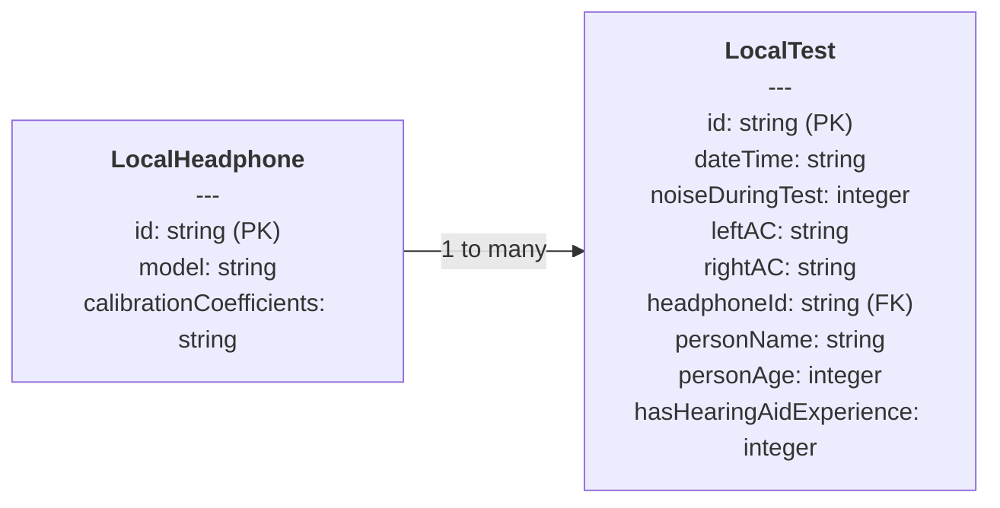

# Database Entity Relationship Diagram

```mermaid
graph LR
    LocalHeadphone["<b>LocalHeadphone</b><br/>---<br/>id: string (PK)<br/>model: string<br/>calibrationCoefficients: string"]
    LocalTest["<b>LocalTest</b><br/>---<br/>id: string (PK)<br/>dateTime: string<br/>noiseDuringTest: integer<br/>leftAC: string<br/>rightAC: string<br/>headphoneId: string (FK)<br/>personName: string<br/>personAge: integer<br/>hasHearingAidExperience: integer"]
    
    LocalHeadphone -->|"1 to many"| LocalTest
```
