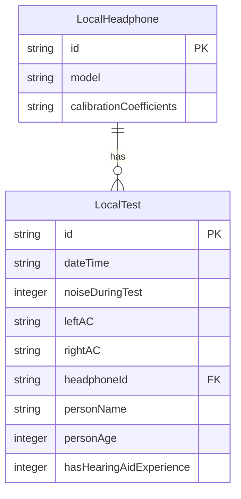

# Database Entity Relationship Diagram

```mermaid
erDiagram
    LocalHeadphone ||--o{ LocalTest : "has"
    
    LocalHeadphone {
        string id PK
        string model
        string calibrationCoefficients
    }
    
    LocalTest {
        string id PK
        string dateTime
        integer noiseDuringTest
        string leftAC
        string rightAC
        string headphoneId FK
        string personName
        integer personAge
        integer hasHearingAidExperience
    }
```
