# AudioSense Use Case Diagram

```mermaid
flowchart TB
    subgraph Actors
        User((👤 User))
        Server[(🖥️ Server)]
    end

    subgraph AudioSense["🎧 AudioSense Application"]
        
        subgraph HomeUseCases["📱 Home"]
            UC1[View Test History]
            UC2[Delete Test]
            UC3[View Test Details]
        end

        subgraph TestUseCases["🔊 Hearing Test"]
            UC4[Start New Test]
            UC5[Enter Personal Details]
            UC6[Select Headphone]
            UC7[Perform Pure Tone Audiometry]
            UC8[Respond to Sound]
            UC9[View Test Progress]
            UC10[Complete Test]
        end

        subgraph ResultUseCases["📊 Results"]
            UC11[View Audiogram]
            UC12[View Hearing Loss Analysis]
            UC13[Share Results]
        end

        subgraph CalibrationUseCases["⚙️ Calibration"]
            UC14[Calibrate Headphone]
            UC15[Add New Headphone]
            UC16[View Calibration Coefficients]
        end

        subgraph DeviceUseCases["🎧 Device Management"]
            UC17[View Available Headphones]
            UC18[Select Authenticated Headphone]
            UC19[Delete Headphone]
        end

        subgraph SyncUseCases["☁️ Data Sync"]
            UC20[Sync Headphones from Server]
            UC21[Upload Test Results]
            UC22[Authenticate with Server]
        end

    end

    %% User interactions
    User --> UC1
    User --> UC2
    User --> UC3
    User --> UC4
    User --> UC5
    User --> UC6
    User --> UC7
    User --> UC8
    User --> UC9
    User --> UC10
    User --> UC11
    User --> UC12
    User --> UC13
    User --> UC14
    User --> UC15
    User --> UC16
    User --> UC17
    User --> UC18
    User --> UC19

    %% Server interactions
    UC20 <--> Server
    UC21 --> Server
    UC22 <--> Server

    %% Include relationships (dashed lines)
    UC4 -.->|includes| UC5
    UC4 -.->|includes| UC6
    UC7 -.->|includes| UC8
    UC7 -.->|includes| UC9
    UC10 -.->|includes| UC11
    UC14 -.->|includes| UC16
    UC17 -.->|includes| UC20
    UC21 -.->|includes| UC22

    %% Extend relationships
    UC4 -.->|extends| UC15
    UC10 -.->|extends| UC21

    classDef actor fill:#e1f5fe,stroke:#01579b,stroke-width:2px
    classDef usecase fill:#fff3e0,stroke:#e65100,stroke-width:1px,rx:10,ry:10
    classDef system fill:#f3e5f5,stroke:#4a148c,stroke-width:2px
    classDef server fill:#e8f5e9,stroke:#1b5e20,stroke-width:2px

    class User actor
    class Server server
    class UC1,UC2,UC3,UC4,UC5,UC6,UC7,UC8,UC9,UC10,UC11,UC12,UC13,UC14,UC15,UC16,UC17,UC18,UC19,UC20,UC21,UC22 usecase
```

## Actors

| Actor | Description |
|-------|-------------|
| **User** | The person using the AudioSense app to perform hearing tests |
| **Server** | The remote backend server that stores authenticated headphones and test results |

## Use Case Categories

### 📱 Home Use Cases

| ID | Use Case | Description |
|----|----------|-------------|
| UC1 | View Test History | User views a list of all previously completed hearing tests |
| UC2 | Delete Test | User deletes a specific hearing test from history |
| UC3 | View Test Details | User views detailed results of a specific test |

### 🔊 Hearing Test Use Cases

| ID | Use Case | Description |
|----|----------|-------------|
| UC4 | Start New Test | User initiates a new pure tone audiometry test |
| UC5 | Enter Personal Details | User enters name, age, and hearing aid experience |
| UC6 | Select Headphone | User selects a calibrated headphone for the test |
| UC7 | Perform Pure Tone Audiometry | System plays tones at various frequencies and volumes |
| UC8 | Respond to Sound | User indicates when they hear a sound |
| UC9 | View Test Progress | User sees current progress (frequency, ear side) |
| UC10 | Complete Test | System finishes test and generates audiogram |

### 📊 Results Use Cases

| ID | Use Case | Description |
|----|----------|-------------|
| UC11 | View Audiogram | User views graphical representation of hearing thresholds |
| UC12 | View Hearing Loss Analysis | User sees analysis of hearing loss levels |
| UC13 | Share Results | User shares audiogram results (export/print) |

### ⚙️ Calibration Use Cases

| ID | Use Case | Description |
|----|----------|-------------|
| UC14 | Calibrate Headphone | User performs headphone calibration procedure |
| UC15 | Add New Headphone | User adds a new headphone to the system |
| UC16 | View Calibration Coefficients | User views calibration data for a headphone |

### 🎧 Device Management Use Cases

| ID | Use Case | Description |
|----|----------|-------------|
| UC17 | View Available Headphones | User views list of all headphones |
| UC18 | Select Authenticated Headphone | User selects a server-authenticated headphone |
| UC19 | Delete Headphone | User removes a headphone from the system |

### ☁️ Data Sync Use Cases

| ID | Use Case | Description |
|----|----------|-------------|
| UC20 | Sync Headphones from Server | System fetches authenticated headphones from server |
| UC21 | Upload Test Results | System uploads completed test results to server |
| UC22 | Authenticate with Server | System authenticates using JWT tokens |

## Relationships

### Include Relationships
- **Start New Test** includes **Enter Personal Details** and **Select Headphone**
- **Perform Pure Tone Audiometry** includes **Respond to Sound** and **View Test Progress**
- **Complete Test** includes **View Audiogram**
- **Calibrate Headphone** includes **View Calibration Coefficients**
- **View Available Headphones** includes **Sync Headphones from Server**
- **Upload Test Results** includes **Authenticate with Server**

### Extend Relationships
- **Start New Test** may extend to **Add New Headphone** (if no headphone available)
- **Complete Test** may extend to **Upload Test Results** (if online)

## User Flows

### Primary Flow: Perform Hearing Test
1. User opens app → **View Test History** (UC1)
2. User taps "New Test" → **Start New Test** (UC4)
3. User enters details → **Enter Personal Details** (UC5)
4. User selects headphone → **Select Headphone** (UC6)
5. System plays sounds → **Perform Pure Tone Audiometry** (UC7)
6. User responds to sounds → **Respond to Sound** (UC8)
7. User monitors progress → **View Test Progress** (UC9)
8. Test completes → **Complete Test** (UC10)
9. User views results → **View Audiogram** (UC11)

### Secondary Flow: Device Setup
1. User needs new headphone → **Add New Headphone** (UC15)
2. User calibrates → **Calibrate Headphone** (UC14)
3. User verifies → **View Calibration Coefficients** (UC16)

### Background Flow: Data Synchronization
1. App starts → **Sync Headphones from Server** (UC20)
2. Test completes → **Upload Test Results** (UC21)
3. Both require → **Authenticate with Server** (UC22)

